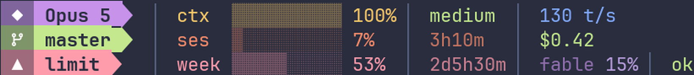

# Noctu — status line themes for Claude Code

Two layouts, five palettes each, for [ccstatusline](https://github.com/sirmalloc/ccstatusline). Built on one rule: **the bar recedes, the number speaks.** Every meter is a muted bar plus a bright value, so the shapes read as texture and your eye lands on what matters.


## Noctu — two rows

Model and context on one row, branch and the weekly limit on the other. Nothing else earns the space: which model you're talking to, how full the context is, where you are in git, and how much of the week you've spent.

```bash
cp themes/noctu/settings.json ~/.config/ccstatusline/settings.json
```

## Panel — three rows

Adds the 5-hour session window as its own row, with cost and change counts beside it.


```bash
cp themes/panel/settings.json ~/.config/ccstatusline/settings.json
```

## Palettes

Both layouts ship in **nocturne** (the default), **palenight**, **dracula**, **tokyo-night** and **material-light** — `themes/<layout>-<palette>/`. They are generated by `scripts/make_themes.py` from one palette definition mapped onto widget roles, so every palette obeys the same rules; only the hues move. Add your own by appending to `PALETTES` and running it.

| | |
|---|---|
| Dracula |  |
| Tokyo Night |  |
| Palenight |  |
| Material Light |  |

Light palettes blend their bars far less toward the background than the dark ones do — at the dark value they wash out to invisible on white. A light theme is not a dark theme inverted.

## Install

Requires **ccstatusline ≥ 2.2.29**, a **Nerd Font**, and a truecolor terminal.

```bash
npm i -g ccstatusline@2.2.29
mkdir -p ~/.config/ccstatusline ~/.claude/scripts
cp themes/noctu/settings.json ~/.config/ccstatusline/settings.json
cp scripts/align-bars.py ~/.claude/scripts/align-bars.py
cp statusline.sh ~/.claude/statusline.sh
```

Then point Claude Code at it, in `~/.claude/settings.json`:

```json
"statusLine": { "type": "command", "command": "bash ~/.claude/statusline.sh", "padding": 0 }
```

## Why there's a script

ccstatusline cannot align these columns. Each row's meter sits behind a variable-width field — your model name, your branch name — so the column moves with them, and `autoAlign` only works in Powerline mode. A config can't know how long `master` is; a post-render pass can just look.

`align-bars.py` reads the rendered lines, finds the first bar glyph on each, measures its column while skipping ANSI escapes, and pads the short rows at zero-width markers the config plants. It runs one pass per marker, which is how the fields *after* the bars line up too. About 25 ms per render. The launcher skips it when the file isn't there.

The launcher also resolves the global ccstatusline install directly rather than through `npx`, which otherwise re-bootstraps npm on **every** render.

## Details

- **Git-aware.** The branch badge, its wedge and its divider all disappear outside a repository — no orphan marks.
- **Fixed width.** No flex stretching, so nothing jumps when you split a pane. Noctu needs ~70 columns, Panel ~100.
- **Model window.** The per-model field tracks Fable, which is the window that currently reports usage; Opus and Sonnet return zero. Swap the widget type if that changes.

## Credit

This is a **configuration, not a fork**. It contains no ccstatusline code. The program is [ccstatusline](https://github.com/sirmalloc/ccstatusline) by sirmalloc (MIT).

## License

MIT
