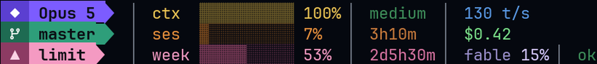
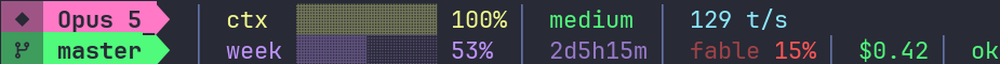
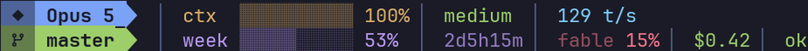
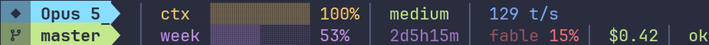
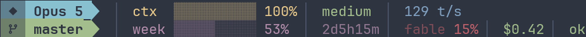
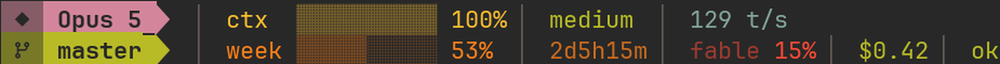
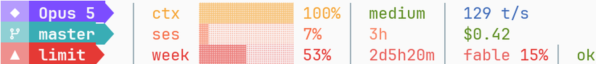

<div align="center">

# Noctu

**Status line themes for [Claude Code](https://claude.com/claude-code)** — two layouts, seven palettes, one rule:
*the bar recedes, the number speaks.*


[](LICENSE)
[](https://github.com/sirmalloc/ccstatusline)
[](#pick-a-theme)

</div>

---

## Why it looks like that

Most status lines shout — saturated blocks end to end, every field the same weight, nothing to land on. Noctu splits every meter in two: a **muted bar** that reads as texture, and a **bright value** that carries the signal. Colour means one thing each — yellow is context, orange the session window, purple the weekly limit, red the model window, blue throughput, green money and health.

Only two things are filled chips, because only two are identity: **which model you're talking to**, and **where you are in git**. Everything else is flat text on your terminal's own background, so your wallpaper still shows through.

And the columns line up. All of them.

## Install

```bash
npm i -g ccstatusline@2.2.29
git clone https://github.com/hasuwini77/ccstatusline-nocturne && cd ccstatusline-nocturne

mkdir -p ~/.config/ccstatusline ~/.claude/scripts
cp themes/noctu/settings.json ~/.config/ccstatusline/settings.json   # the default
cp scripts/align-bars.py ~/.claude/scripts/align-bars.py
cp statusline.sh ~/.claude/statusline.sh
```

Then in `~/.claude/settings.json`:

```json
"statusLine": { "type": "command", "command": "bash ~/.claude/statusline.sh", "padding": 0 }
```

Needs a **Nerd Font** and a truecolor terminal — WezTerm, Ghostty, iTerm2, Kitty, Windows Terminal.

## Pick a theme

Every theme is `themes/<name>/settings.json`. Copy one over `~/.config/ccstatusline/settings.json` and it's live on the next render.

### Noctu — two rows *(default)*

Model and context above, branch and the weekly limit below. Four things earn a permanent place; the rest fills the columns that would otherwise be dead space. Works from ~70 columns.


### Panel — three rows

Adds the 5-hour session window as its own row, with cost and change counts beside it. Works from ~100 columns.



### The palettes

Both layouts ship in all seven — `themes/noctu-dracula`, `themes/panel-nord`, and so on. **Each leads with its own signature colour** rather than every theme defaulting to a purple model chip, so they're told apart at a glance.

**Dracula** — leads pink


**Tokyo Night** — leads blue


**Palenight** — leads cyan


**Nord** — cold and low-chroma, no warm accent anywhere


**Gruvbox** — warm and earthy, the far end from Nord


**Material Light** — for light terminals, and not a dark theme inverted: its bars blend far less toward the background, because at the dark value they wash out to nothing on white.


## The aligned columns

ccstatusline cannot do this, and it's worth knowing why: each row's meter sits behind a **variable-width field** — your model name, your branch name — so the column moves with them. `autoAlign` only works in Powerline mode. A config file cannot know how long `master` is.

A post-render pass can just look. `scripts/align-bars.py` reads the rendered lines, finds the first bar glyph on each, measures its real column while skipping ANSI escapes, and pads the short rows at **zero-width markers** the config plants. It runs one pass per marker, which is how the fields *after* the bars line up too — four aligned columns, at any width, with any branch name.

About 25 ms per render. The launcher skips it when the script isn't there, so nothing breaks without it.

`statusline.sh` also hands the globally installed ccstatusline straight to node instead of going through `npx`, which otherwise re-bootstraps the npm CLI on **every single render**.

## No ccstatusline? One file, no dependencies

[`standalone/noctu.py`](standalone/noctu.py) is the same design as a single script that reads the session JSON and prints two rows — no packages, no network, nothing to install.


```json
"statusLine": { "type": "command", "command": "python3 ~/.claude/noctu.py", "padding": 0 }
```

It carries model, context, effort, git, the weekly limit with its reset, cost, duration and lines changed, all read from the session JSON with no network access. Only the Fable window needs the usage endpoint, so that stays with the themes. Released under CC0 so it can be shared in galleries that require it.

## Make your own palette

Themes aren't hand-coloured. `scripts/make_themes.py` maps one palette definition onto widget **roles** — chip bodies, icon cells, each meter's bar/value pair, timers, accents — and derives the muted bars by blending each accent toward that theme's own background. Add eight lines and run it:

```python
'my-theme': dict(bg='11121A', fg='CDD6F4', glyph='FFFFFF', model='CBA6F7', branch='A6E3A1',
   limit='B4BEFE', ctx='F9E2AF', ses='FAB387', week='B4BEFE', green='A6E3A1', blue='89B4FA',
   yellow='F9E2AF', red='F38BA8', sep='6C7086'),
```

```bash
python3 scripts/make_themes.py
```

Pass `light=True` for light backgrounds and the blends adjust.

## Details worth knowing

- **Git-aware.** Outside a repository the branch chip steps aside for a muted `no git` chip in the same slot — the divider grey sunk toward the background, not bold, so it holds the row's shape without posing as identity. It's a `custom-command` widget running `git rev-parse || echo no git`: silent inside a repo, one line outside, and the same syntax in `sh` and Windows `cmd`. It checks the directory Claude Code launched the status line in. `bash scripts/test-no-git.sh` renders every theme on both sides of the line.
- **Fixed width.** No flex stretching, so nothing moves when you split a pane.
- **The model window tracks Fable.** On this account `weeklyOpusUsage` and `weeklySonnetUsage` report zero while `fableUsage` reports real numbers — check `~/.cache/ccstatusline/usage.json` and swap the widget type if that changes for you.
- **Bars are two widgets.** A `slider-only` meter in the muted tint, then the same widget again with `rawValue` for the bright number. That split is the whole look.
- **Colours need `hex:RRGGBB`** — no `#`. With the `#` ccstatusline silently renders them uncoloured.

## Credit

This is a **configuration, not a fork** — it contains no ccstatusline code. The program is [ccstatusline](https://github.com/sirmalloc/ccstatusline) by **sirmalloc**, MIT licensed. Go star it.

## License

MIT © [hasuwini77](https://github.com/hasuwini77)
